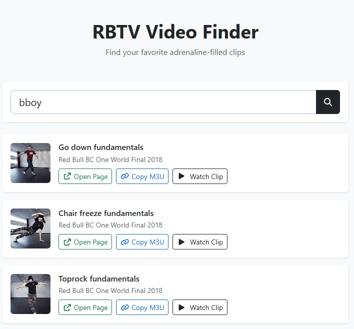

# Red Bull TV Video Finder (Cloudflare Worker)

A lightweight search tool built on **Cloudflare Workers** that helps you quickly find videos and clips from Red Bull TV.



## How to Deploy

#### API

1. Go to the Cloudflare Dashboard  
2. Navigate to **Workers & Pages**  
3. Click **Create Application → Start with Hello World**, enter your preferred Worker name, then click **Deploy**  
4. Open the Worker and click **Edit code** and Replace the default code of `worker.js` with the JavaScript file located at `rbtv-video-finder-api-js/src/index.js`  
5. Click **Deploy**  
6. (Optional) Configure routes or attach a custom domain  

#### Front-end

1. Clone the project
```
git clone https://github.com/bboymega/rbtv-video-finder-worker
```
2. Compile react project
```
cd rbtv-video-finder-react
npm install
npm run build
```
3. Navigate to **Workers & Pages** in the Cloudflare Dashboard
4. Click **Create Application → Looking to deploy Pages? Get started → Drag and drop your files → Get started** 
5. Create a name for your project
6. Upload the build output folder located at `rbtv-video-finder-react/out`
7. Click **Deploy site**

## Disclaimer

This program functions solely as a **search engine** for existing clips and videos from Red Bull TV.

- We do **not** host or store any videos or other media  
- All requests are automatically redirected to official pages and resources  
- All content rights remain with their respective owners

## Test Site (CORS Protection Enabled)

[Test Site](https://rbtv-video-finder.pages.dev/)
